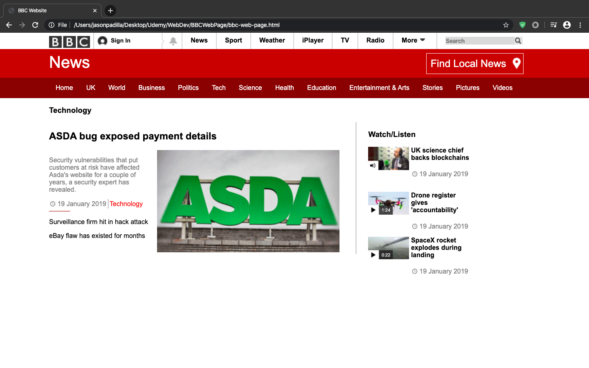

# BBC News WebPage
This is the first webpage I created while learning how to develop websites through Udemy. It is a mockup of the front page of the BBC News Website, however it does not link to any other pages from the website and the videos displayed do not play.
# What I Learned
* HTML div formatting and positioning
* Use of ids and classes
* CSS styling of divs,links,images,lists
# Screenshots

